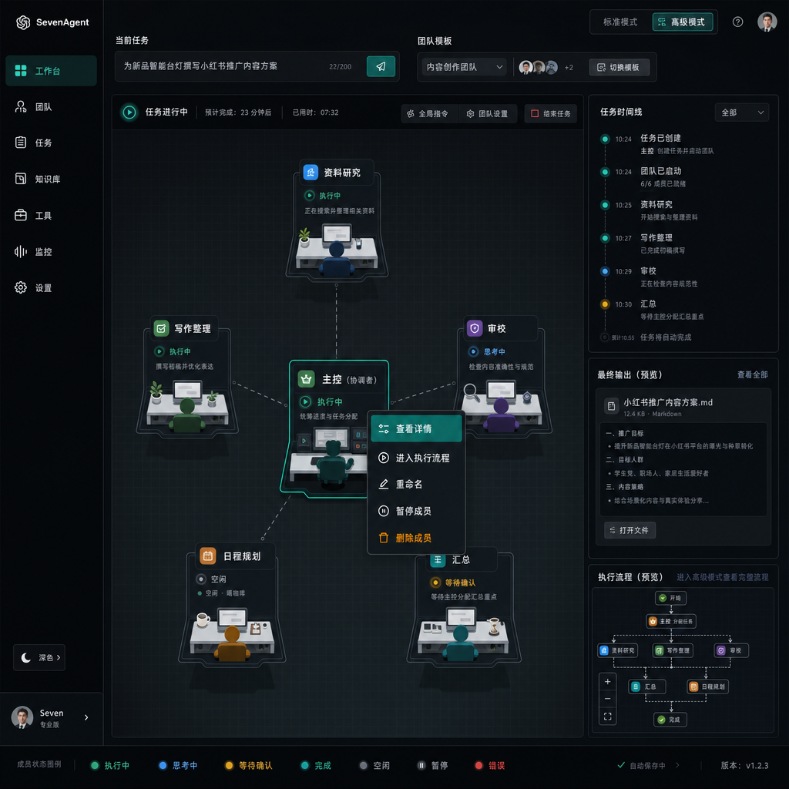

# SevenAgent Command Center Design

## Purpose

This document defines the next visual and interaction direction for SevenAgent.

SevenAgent should feel like a command center where a user assembles an AI team around a task, watches specialized members collaborate, and opens execution flows only when deeper control is needed.

Reference concept:

## Product Direction

SevenAgent is not a pile of agent cards.

The primary experience should be:

1. The user states a goal.
2. SevenAgent selects or creates a team.
3. A coordinator breaks down the work.
4. Specialized members collaborate.
5. The user watches progress, handles confirmations, and receives a final result.

The interface should support non-developer users. Software development can be one team template, but the default language should be team/member/task-oriented.

## Main Screen Model

The default screen should be a command center with four zones:

1. Sidebar
   Stable navigation and global mode controls.

2. Task Command Bar
   The current task, active team template, team members, and primary task controls.

3. Collaboration Workspace
   A spatial view of the coordinator and member stations. This replaces the current feeling of a grid of unrelated cards.

4. Right Activity Rail
   Task timeline, final output preview, and a compact execution-flow preview.

## Sidebar

The sidebar should feel like a quiet system shell.

Recommended items:

- 工作台
- 团队
- 任务
- 知识库
- 工具
- 监控
- 设置

Rules:

- Keep it dark in both modes if the command-center direction remains dark-first.
- Use Ant Design icons.
- Avoid layout jitter when collapsing or expanding.
- The collapsed brand area should act as the expand trigger.

## Task Command Bar

The top task area should answer:

- What is the current goal?
- Which team template is active?
- Is the task running, paused, or waiting?
- What can the user do now?

Suggested controls:

- Current task input.
- Team template selector.
- Team member avatars or compact chips.
- Start / stop / confirm controls.
- Advanced mode entry.

Example labels:

- 当前任务
- 团队模板
- 协作模板
- 任务运行中
- 结束任务

## Collaboration Workspace

The center area should show the team as a working system.

Recommended structure:

- Coordinator station near the center.
- Specialized member stations around it.
- Subtle dashed or solid dependency lines.
- Current activity highlighted with a teal/green accent.
- Waiting confirmation shown with amber.
- Error shown with a small red indicator only.

The user should be able to understand:

- Who is leading the task.
- Which member is active.
- Which member is waiting.
- Which member produced output.
- How work is being passed between members.

## Station Design

A station is a visible, controllable position for a specialized member.

It can look like a compact workstation, console, node, dock item, or swimlane entry. It does not need to be a traditional rectangular card.

Each station should show:

- Role name.
- Current action.
- Status.
- Optional mood for idle members.
- Tiny workstation/desk/character visual.
- Capability or role icon.

Station content priority:

1. Role
2. Status
3. Current action
4. Recent output hint
5. Illustration

The illustration must never cover text.

## Default Team Example

For a non-developer friendly default, use a content or daily assistant team:

- 主控
- 资料研究
- 写作整理
- 审校
- 日程规划
- 汇总

Developer-specific members can exist in the software development template:

- 架构
- 代码
- UI
- 测试
- Review
- 发布

## Status Model

Official statuses:

- `idle`: 空闲
- `thinking`: 思考中
- `running`: 执行中
- `waiting`: 等待确认
- `done`: 完成
- `error`: 错误
- `paused`: 暂停

Do not add `resting` as a data status.

Idle moods are display-only:

- 空闲 · 喝咖啡
- 空闲 · 休息中
- 空闲 · 看资料
- 空闲 · 待命中
- 空闲 · 伸懒腰

Scheduling rule:

- `idle` can accept work.
- `paused` cannot accept work.

## Right-Click Menu

Station right-click menus must be readable in dark mode.

Recommended items:

- 查看详情
- 进入执行流程
- 重命名
- 暂停成员
- 删除成员

Rules:

- Dark menu background.
- Off-white normal text.
- Muted secondary text.
- Teal/green hover and selected state.
- Amber/orange destructive action.
- Avoid red-heavy menus.
- Do not allow selected text to become low-contrast.

## Right Activity Rail

The right rail should make collaboration explainable.

Sections:

1. 任务时间线
   Shows task creation, coordinator planning, member starts, confirmations, errors, and completion.

2. 最终输出
   Shows the current deliverable or a preview of the final result.

3. 执行流程
   Shows a compact X6-like preview and entry to advanced mode.

The rail should reduce anxiety. The user should not need to guess what the team is doing.

## Execution Flow

X6 remains important, but it should be advanced inspection/editing.

Normal users should see team progress first.

Advanced users can open:

- Member execution flow.
- Task handoff rules.
- Tool/API call nodes.
- Test and save controls.
- Node connections.

Suggested label:

- 执行流程

Avoid making "workflow" the first concept for non-technical users.

## Visual Language

Base direction:

- Dark graphite canvas.
- Subtle grid, visible but quiet.
- Off-white station surfaces.
- Teal/green active accent.
- Amber waiting accent.
- Muted slate idle accents.
- Red only for small error indicators.

Rules:

- Avoid big gradients and decorative orbs.
- Avoid thick bright borders.
- Avoid red cards.
- Keep border radius at 8px or below for panels and stations.
- Use stable dimensions for station nodes and controls.
- Keep text above illustrations in hierarchy.
- Menus must have enough contrast in dark mode.

## Interaction Notes

Core interactions:

- Click station: select and show details.
- Right-click station: open action menu.
- Double click or menu item: enter execution flow.
- Click blank workspace: clear selection.
- Use right rail to inspect timeline and outputs.
- Use top command bar to control task-level actions.

Future interactions:

- Drag stations to arrange team layout.
- Switch team template.
- Save current team as template.
- Open advanced mode for X6 editing.
- Confirm waiting actions from the timeline or selected station.

## Migration From Current UI

Current UI already has useful pieces:

- Dark workspace grid.
- Station-like cards.
- Right-click menus.
- X6 execution flow.
- API configuration.
- Logs.
- Dark/light mode.

Recommended migration order:

1. Rename product concepts in UI copy:
   Agent -> member where user-facing.
   Workflow -> execution flow where user-facing.
   Add task/team language.

2. Update status model:
   Replace resting with idle mood.
   Add thinking, waiting, done, paused if missing.

3. Add a task command bar:
   Current task, team template, running state, task controls.

4. Convert grid cards into stations:
   Reduce card weight.
   Move role/status/action above illustration.
   Make idle mood display-only.

5. Add coordinator-centered workspace:
   Show 主控 in the center.
   Position members around it.
   Add subtle dependency lines.

6. Add right activity rail:
   Timeline, output preview, execution-flow preview.

7. Keep X6 as advanced mode:
   Preserve node CRUD, drag, connect, test, save.

## Open Questions

- Should the default team be daily assistant, content creation, or software development?
- Should users start from a task input or from a team template picker?
- Should stations be draggable in the main workspace, or arranged by template?
- Should the coordinator always exist, or can advanced users remove it?
- Should final output live in the right rail, a full document view, or both?

